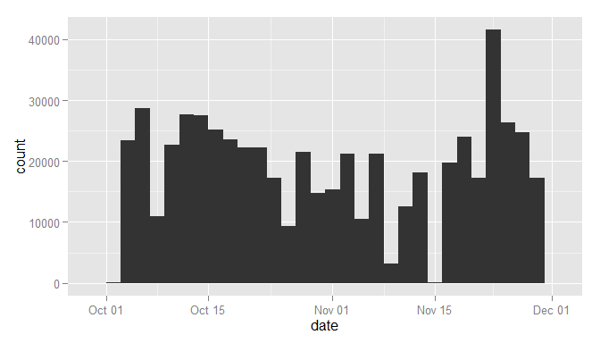
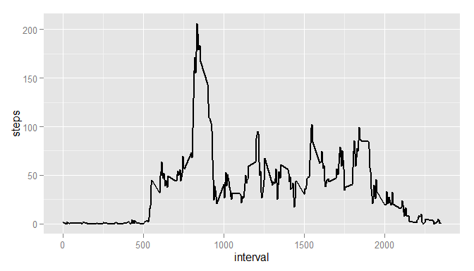
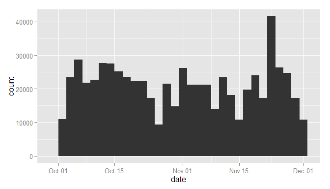
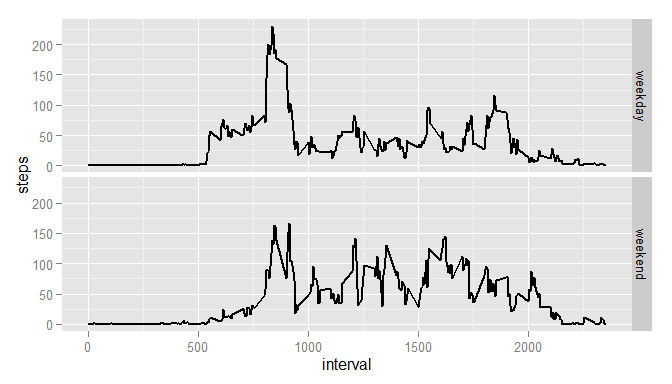

# Reproducible Research: Peer Assessment 1
Kyryl Ielizarov  
Sunday, March 15, 2015  


Required packages are:  
  - `dplyr`  
  - `ggplot2`  

Also if your system has not English language as default you should run next code wor Windows:

```r
Sys.setlocale("LC_TIME","English_United States.1252")
```

```
## [1] "English_United States.1252"
```


### Loading and preprocessing the data

File 'activity.csv' should be placed in working directory.


```r
df <- read.csv("./activity.csv")
```

In preprocessing 'date' was converted to `Date` class

```r
df$date <- as.Date(df$date)
```


### What is mean total number of steps taken per day?

Calculating the total number of steps taken per day:

```r
stepData1 <-summarize(group_by(df,date), stepNumber=sum(steps,na.rm=TRUE))
```

Making a histogram of the total number of steps taken each day (binwidth defaulted to range/30):

```r
ggplot(stepData1, aes(x=date)) + geom_histogram(aes(weight=stepNumber))
```

 

Calculate and report the mean and median of the total number of steps taken per day:

```r
stepMean<-round(mean(stepData1$stepNumber,na.rm=TRUE),2)
stepMedian<-median(stepData1$stepNumber,na.rm=TRUE)
```

Mean of the total number of steps is 9354.23 and median of the total number of steps is 10395.


### What is the average daily activity pattern?
Making a time series plot of the 5-minute interval (x-axis) and the average number of steps taken, averaged across all days (y-axis)

```r
stepData2 <- summarize(group_by(df,interval), steps=mean(steps,na.rm=TRUE))
ggplot(stepData2, aes(x=interval, y=steps)) + geom_line( size = 1)
```

 


Finding which 5-minute interval, on average across all the days in the dataset, contains the maximum number of steps:

```r
stepData2[which.max(stepData2$steps),]
```

```
## Source: local data frame [1 x 2]
## 
##   interval    steps
## 1      835 206.1698
```


### Imputing missing values
There are a number of days/intervals where there are missing values (coded as NA). The presence of missing days may introduce bias into some calculations or summaries of the data.

Let's calculate the total number of missing values in the dataset (i.e. the total number of rows with NAs)

```r
notNA<-complete.cases(df)
sum(as.numeric(!notNA))
```

```
## [1] 2304
```

There were devises a strategy for filling in all of the missing values in the dataset. The strategy is to use the mean/median for that day, or the mean for that 5-minute interval. Also there is created an new dataset that is equal to the original dataset but with the missing data filled in.

```r
replacedNA <- merge(df[!notNA,2:3],stepData2,by.x="interval",by.y="interval",all.x=TRUE)
cleanedDF<-rbind(df[notNA,],replacedNA)
```

Making a histogram of the total number of steps taken each day:

```r
stepData3 <-summarize(group_by(cleanedDF,date), stepNumber=sum(steps,na.rm=TRUE))
ggplot(stepData3, aes(x=date)) + geom_histogram(aes(weight=stepNumber))
```

 

Calculating the mean and median total number of steps taken per day:

```r
stepMeanNoNA<-mean(stepData3$stepNumber)
stepMedianNoNA<-median(stepData3$stepNumber)
```

Lets report this values and whatch the difference from values calculated using original dataset:

```r
data.frame(Mean=c(stepMean,stepMeanNoNA),Median=c(stepMedian,stepMedianNoNA),row.names=c("Original Dataset","Dataset with excluded NA'a"))
```

```
##                                Mean   Median
## Original Dataset            9354.23 10395.00
## Dataset with excluded NA'a 10766.19 10766.19
```
We can see that there is huge difference in values especially in Mean. Also it made mean and median equal. It could be more sophisticated to use median value insted of mean.


### Are there differences in activity patterns between weekdays and weekends?
Creating a new factor variable in the dataset with two levels – “weekday” and “weekend” indicating whether a given date is a weekday or weekend day:

```r
cleanedDF$day<-weekdays(cleanedDF$date)
cleanedDF$week<-as.factor(sapply(cleanedDF$day,function(x) {if (x %in% c("Monday","Tuesday","Wednesday","Thursday","Friday") ) {"weekday"} else {"weekend"}}))
```

Making a panel plot containing a time series plot  of the 5-minute interval (x-axis) and the average number of steps taken, averaged across all weekday days or weekend days (y-axis):

```r
stepData4 <- summarize(group_by(cleanedDF,interval,week), steps=mean(steps,na.rm=TRUE))
ggplot(stepData4, aes(x=interval, y=steps)) + geom_line( size = 1) + facet_grid(week~.)
```

 
